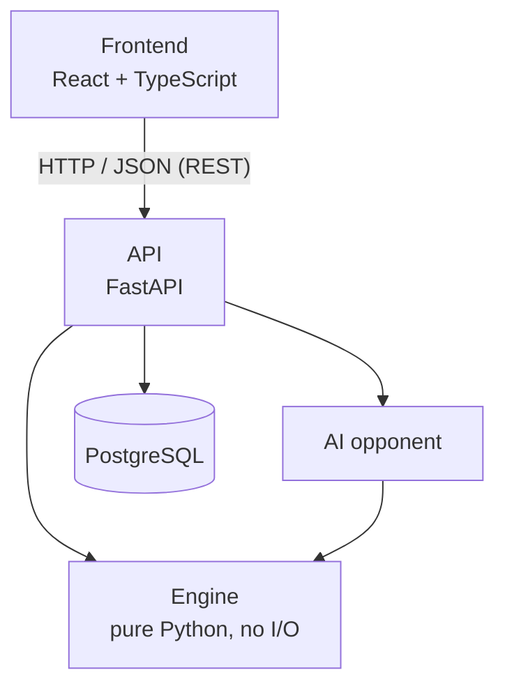

# Rowen — Project Plan

> Living document. Update it when a decision changes.

## Goal

Rowen is a turn-based card game inspired by the Gwent minigame from *The Witcher 3*.
It is a personal, non-commercial project, built as a complete full-stack application
to the standards of professional software: a well-tested domain core, a typed API,
a relational database, a modern frontend, CI/CD and a live deployment.

**Definition of success:** anyone can open a link and play a full match against the
AI as a guest within seconds, with nothing to install, and the codebase behind it is
clean, tested and documented.

## Architecture



Principles:

1. **Pure engine.** `rowen.engine` has no third-party dependencies and no I/O
   (no web, no database, no printing). The layering is enforced in CI with
   import-linter, so it cannot erode by accident.
2. **Immutable state, pure transitions.** The core API is
   `legal_actions(state)` and `apply(state, action) -> (new_state, events)`.
   This makes testing trivial, lets the AI simulate moves safely, and lets the
   frontend animate from the returned events.
3. **Server-authoritative.** The client only sends intents ("play card X on row Y").
   The server validates them and returns only what that player is allowed to see
   (the opponent's hand is never sent).
4. **Data-driven cards.** Cards live in JSON. Abilities are referenced by key
   (`"ability": "tight_bond"`) and implemented once in code.
5. **Deterministic.** The random seed is part of the state. Same seed + same actions
   = same game, which gives replays and reproducible bug reports for free.
6. **One API for everyone.** The AI uses exactly the same engine API as a human.
7. **Typed end to end.** mypy strict on the backend, TypeScript strict on the
   frontend, and frontend types generated from the API's OpenAPI schema.

## Tech stack

| Area | Choice |
|---|---|
| Language (backend) | Python 3.14 |
| Package/env manager | uv |
| Web API | FastAPI + Pydantic |
| Database | PostgreSQL, SQLAlchemy 2 (typed ORM), Alembic (migrations) |
| Backend tests | pytest, Hypothesis (property-based), pytest-cov |
| Backend quality | ruff (lint + format), mypy `--strict`, import-linter |
| Frontend | React, TypeScript (strict), Vite, TanStack Query, Tailwind CSS |
| Frontend tests | Vitest, React Testing Library, Playwright (end-to-end) |
| API contract | OpenAPI → generated TypeScript types |
| Infra | Docker, Docker Compose, GitHub Actions (CI + CD) |
| Hosting | Decided in Phase 2 (recorded as an ADR) |

## Repository layout

```
rowen/
├── backend/
│   ├── src/rowen/
│   │   ├── engine/      # rules, state, turns, scoring (stdlib only)
│   │   ├── data/        # card definitions (JSON)
│   │   ├── ai/          # AI opponent (depends only on engine)
│   │   ├── api/         # FastAPI routes and schemas
│   │   ├── db/          # SQLAlchemy models and repositories
│   │   └── cli.py       # play in the terminal (dev tool)
│   ├── migrations/      # Alembic
│   ├── tests/
│   └── pyproject.toml
├── frontend/            # React + TypeScript + Vite
├── docs/
│   ├── plan.md          # this file
│   ├── rules.md         # game rules
│   └── adr/             # architecture decision records
├── .github/workflows/
├── docker-compose.yml
└── README.md
```

## Roadmap

Every milestone ends in a tagged release, a demo-able state and an updated README,
so the repository is presentable at any point in time.

### Phase 0 — Foundations

- `docs/rules.md`: Rowen rules, close to Witcher 3 Gwent, split into *MVP* and
  *later* mechanics. **Approved by Rui before any engine code.**
- Monorepo scaffold, uv project, ruff, mypy, pytest, import-linter, pre-commit.
- GitHub Actions running lint, type-check and tests on every push and PR.
- `.gitattributes` (LF line endings, Windows-safe), VS Code recommended settings.
- LICENSE (code) and a note on asset licensing.
- First ADRs: web full-stack architecture, pure engine design, monorepo,
  server-authoritative game.
- GitHub: milestones per phase, issues per task, branch protection on `main`.

Done when: CI is green on the skeleton and the rules are approved.

### Phase 1 — Game engine → `v0.1.0`

- Card model and JSON loader with validation; starter set of 2 factions.
- Game setup (seeded shuffle, deal 10, redraw), turns, passing, rounds, scoring,
  match winner.
- MVP abilities as defined in `rules.md`.
- Player view: what each player is allowed to see.
- Baseline AI: simple heuristics (not random — it must be fun to play against).
- CLI to play a full match in the terminal.
- Tests: unit tests per rule plus Hypothesis invariants (no card is ever lost or
  duplicated, score always equals the sum of the board, every match terminates).
  Engine coverage ≥ 90 %.

Done when: a full match against the AI is playable in the terminal and every MVP
rule has tests.

### Phase 2 — Walking skeleton, playable online → `v0.2.0`

- FastAPI endpoints: start a match against the AI, get the player view, submit an
  action. Consistent error responses.
- PostgreSQL + SQLAlchemy + Alembic: `matches` table (state + action log).
- React app: basic board, hand, play a card, pass, round and match results
  (no art yet).
- TypeScript types generated from OpenAPI.
- Docker Compose for local development (API + DB + frontend).
- Deployment to a public URL and CD on merge to `main`.

Done when: anyone with the link can play a full match as a guest.

### Phase 3 — Real interface → `v0.3.0`

- Board layout and card component: frame, strength and ability rendered from card
  data; the image is only the illustration.
- Card art pipeline (PNG → WebP, files named by card id), placeholders until art
  exists.
- Animations driven by engine events.
- UX: ability tooltips, round summary, end-of-match screen.
- Frontend tests (Vitest + Testing Library) and a Playwright smoke test.

Done when: it looks good enough for the README GIF.

### Phase 4 — Accounts and persistence → `v0.4.0`

- Registration and login (hashed passwords, secure cookie session); guest mode
  stays.
- Deck builder: pick a faction and cards, validated by the engine's rules.
- Match history and personal statistics.
- *Could:* leaderboard.

### Phase 5 — Smarter AI and full rules → `v0.5.0`

- Remaining mechanics from `rules.md` (for example leaders and faction passives).
- Monte Carlo AI (samples the hidden hand, simulates outcomes) with difficulty
  levels.
- Headless simulator: AI vs AI tournaments and a card-balance report.

### `v1.0.0` — First stable release

- README: GIF, live link, architecture diagram, how to run locally, testing
  strategy, links to the ADRs.
- Final pass on code quality and documentation.

### Later (only after `v1.0.0`)

- Player vs player over WebSockets.
- Replay viewer.
- New factions and cards (Rui).

## Working agreement

- Claude writes the code; Rui reviews every pull request and must understand it
  before merging.
- Every change goes through a branch and a pull request, CI must pass, commits
  follow Conventional Commits, pull requests stay small.
- Only Rui merges into `main`, using *Squash and merge* (one commit per pull
  request, titled after it). Nobody pushes to `main` directly.
- Each pull request explains *what* and *why*; Claude also explains it in
  Portuguese in the conversation.
- Significant decisions are recorded as ADRs in `docs/adr/`.
- End of every milestone: a retrospective on that phase (what was built, which
  decisions were made and why).
- Scope guard: nothing from "Later" before `v1.0.0`.

## Risks

| Risk | Mitigation |
|---|---|
| Scope grows too large | Every milestone is demo-able on its own; cut *Could* items first. |
| Code written faster than it is understood | Small PRs, every design decision explained, milestone retrospectives, Rui implements some features himself (new cards/factions). |
| Free hosting limits (cold starts, database expiry) | Choose hosting in an ADR in Phase 2; everything runs in Docker so it can move. |
| AI-generated card art | Consistent style, no imitation of the original game's characters, tool documented in the README. |
| Windows vs Linux differences | LF line endings via `.gitattributes`, PostgreSQL in Docker. |
